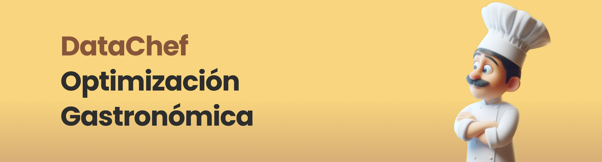
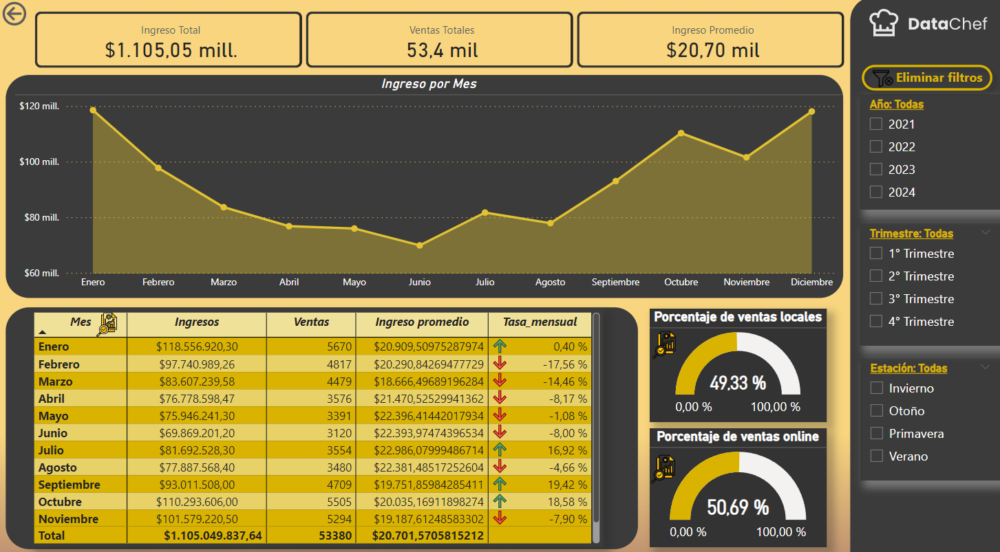
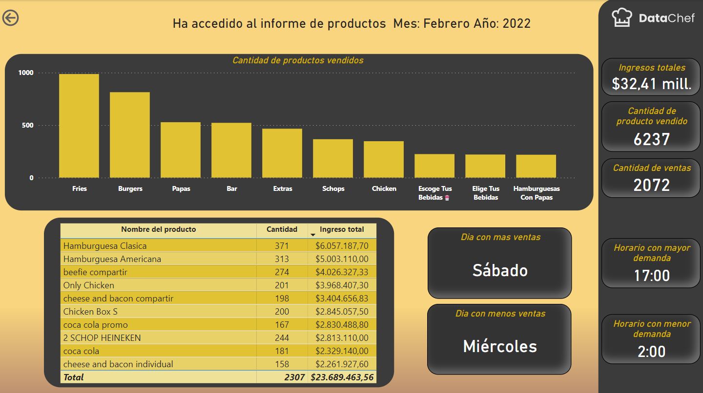
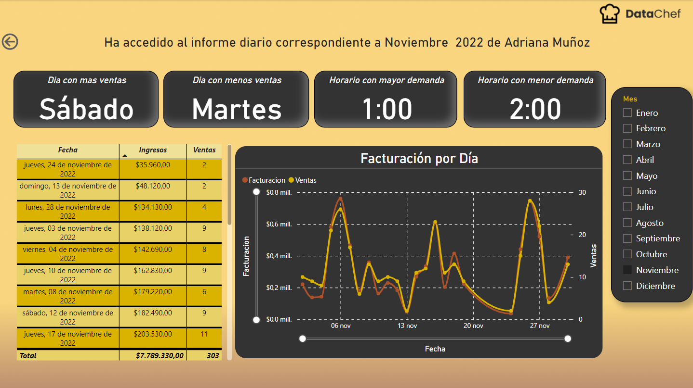
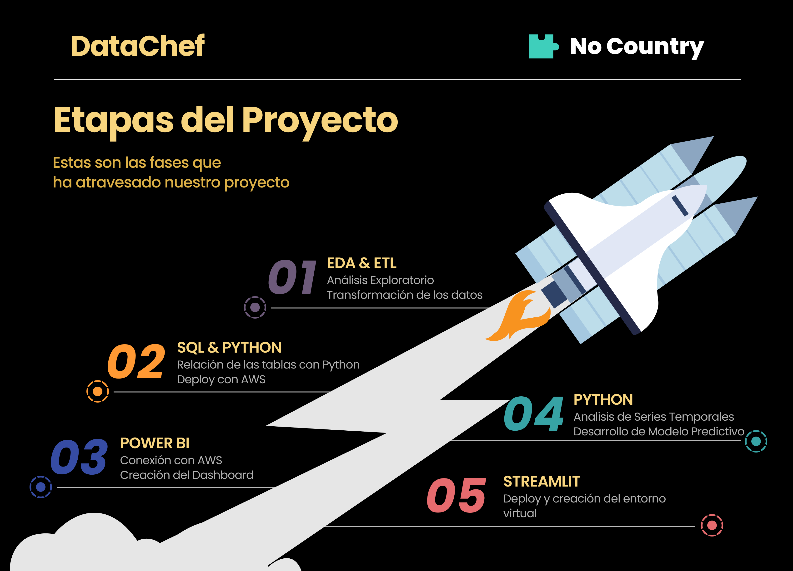
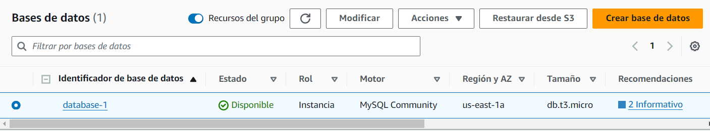
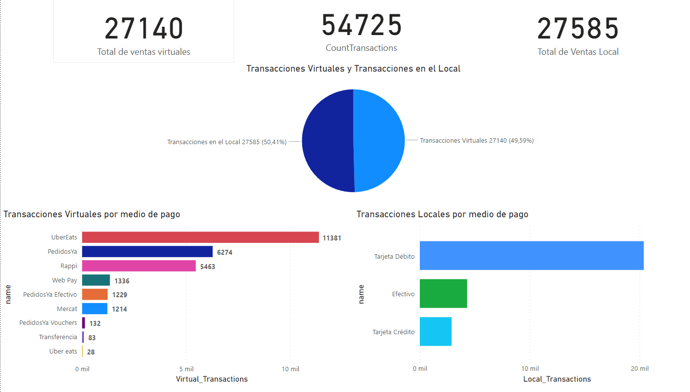
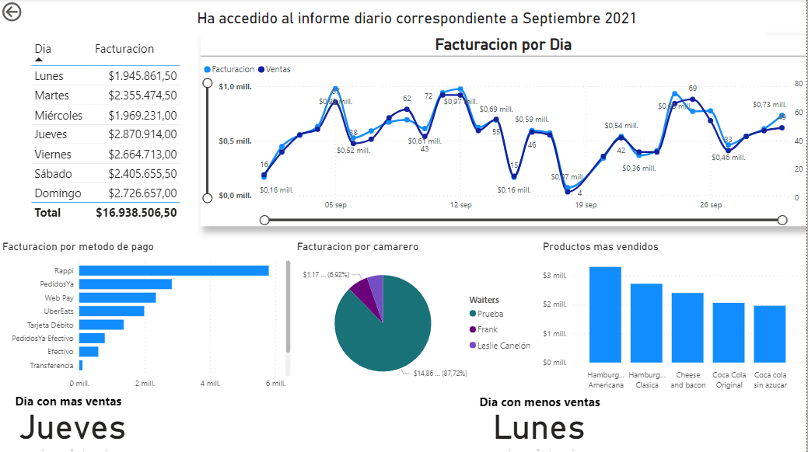

<h3><b>¡Bienvenid@s al repositorio del grupo 95 del cohorte 16 de data-bi de No Country! </b></h3>
 

<h1><b>DataChef: Optimización Gastronómica</b></h1>
 

En un mercado gastronómico cada vez más competitivo, el éxito de un restaurante se sustenta en la eficiencia y la rentabilidad. La intuición y la experiencia tradicionales ya no bastan en este entorno. Para destacarse, los restaurantes deben valerse de herramientas que les permitan tomar decisiones estratégicas respaldadas por datos concretos. El análisis de datos y la implementación de modelos predictivos se vuelven imprescindibles en este contexto. Estas tecnologías innovadoras ofrecen una perspectiva hacia el futuro al proporcionar información valiosa sobre el comportamiento de los clientes, las tendencias del mercado y el rendimiento del negocio. El propósito de este proyecto de análisis de datos es aprovechar estas tecnologías para optimizar las operaciones y estrategias de ventas del restaurante, aumentando su eficiencia y rentabilidad. A través de un minucioso análisis de los datos disponibles, se identificarán áreas de mejora, se desarrollarán modelos predictivos para la demanda y la toma de decisiones, y se personalizará la experiencia del cliente.

 

****
 
<h3 align="center"> Miembros del Equipo</h3>

****
 

|Participantes|Roles|Redes|
|:---:|:---:|:---:|
|**Franco Arce**|    |     |
|**Leopoldo Flores**||  |
|**Matias Ferreyra**||  |
|**Adriana Muñoz**|   |  |
|**Rodrigo Valdez**|   |  |
|**Julio Dip**||  |
|**Matias Ibarra**|      |  |
|**Maria Celeste Coronel**||  |
|**Diego Gallegos Estudillo**||  |
|**Angel Gallegos Estudillo**||  |
 

<h2>Stack de Tecnologías </h2>

<h2>Producto mínimo viable (MVP):</h2>
 
Nuestro objetivo con este gestor es brindar a los propietarios y gerentes de restaurantes una herramienta poderosa y eficiente para optimizar sus operaciones diarias. Al tener acceso a información detallada sobre las ventas, pueden identificar tendencias, ajustar su inventario, mejorar la eficiencia en el servicio y brindar una experiencia aún mejor a sus clientes. Las predicciones de ventas les permiten planificar con anticipación y estar preparados para satisfacer la demanda de manera efectiva. En resumen, nuestro MVP está diseñado para ser una herramienta integral que ayude a los restaurantes a crecer y prosperar en un mercado competitivo.
 

<h2>Dashboard Interactivo Power BI</h2>

 
<h2>Etapas del Proyecto</h2>

 

****
 

  

****
<h1 align='center' >Memoria del Proyecto</h1>

<h2 align='center' >Sprint 0</h2>

- #### Creación del canal de Discord:
Desde el grupo de Slack se propuso utilizar Discord como medio de comunicación por su facilidad para compartir pantalla, dividir la comunicación en canales y por ser una herramienta que la mayoría sabia utilizar.
En la imagen siguiente se muestra como fue la división de canales y salas de reuniones:

- #### Primeras reuniones para conocernos.
A través de Discord programamos un horario conveniente para tener nuestra primera reunión. En ella nos conocimos, compartimos nuestra experiencia previa, organizamos horarios y roles.

- #### Definición de horario de reuniones diarias.
Definimos que el horario de reunión diaria sería todos los días a las 9 AM hora Argentina, con exccepción de Lunes y Jueves cuando nos reunimos luego de la reunión con el TL (9:30 AM)

- #### Primeras ideas sobre proyectos.
Se barajaron varias opciones al principio, pero la decisión por unanimidad fue crear un gestor de restaurantes
partiendo de datos reales del local donde trabaja una de las integrantes del grupo. Nos pareció la mejor opción no solo por el potencial que vimos en estos datos sino por tratarse de un caso real, lo que representa un desafio mayor.

<h2 align='center' >Sprint 1</h2>

- #### Elección del proyecto
A partir de la elección de nuestro proyecto de ggestión de restaurantes, al que llamamos DataChef, comenzamos el print 1.

- #### User Stories:

1. Como propietario del restaurante, quiero poder acceder a análisis detallados sobre las ventas para la eficiencia operativa.
2. Como gerente del restaurante, quiero recibir predicciones de las ventas de productos para ajustar el inventario y evitar la escasez o el exceso de stock.
3. Como gerente del restaurante, quiero recibir mensualmente promociones más rentables para aumentar las ventas en horarios de poca demanda.
4. Como gerente del restaurante, quiero saber la eficiencia de los empleados para incrementar el ticket promedio.

- #### Primera extracción y limpieza de datos:
Obtenemos los datos con los que el restaurante cuenta actualmente, a través de la API con la que el local trabaja.
Podemos ver la estructura que tenian en ese momento:

En el archivo [conexión_api](./base_de_datos/conexion_api.ipynb) se puede ver todo el proceso de extracción y limpieza.

- #### Creación de tablas y relaciones:
Mediante cambios en la estructura de los datos, se definieron distintas tablas en las que dividimos los registros, para su escalabilidad. De esta manera la base de datos no solo es más eficiente y optimiza el rendimiento, sino que permite hacer análisis más detallados de algunos puntos importantes, como las ventas por productos.

En el archivo [conexión_bbdd](./base_de_datos/conexion_bbdd.ipynb) se puede ver también cómo se crean las diferentes tablas y sus relaciones.

- #### Creación de la base de datos en AWS
El método para alojar nuestros datos es Amazon Web Service.

En el archivo [conexión_bbdd](./base_de_datos/conexion_bbdd.ipynb) se puede ver también cómo se crean las diferentes tablas y sus relaciones.

- #### Conexión de la base de datos a Power Bi y primeros análisis
Una vez creada la base de datos, alojada en la nube, el equipo de análisis de datos comenzo con los primeros análisis.

### Sprint 2:
