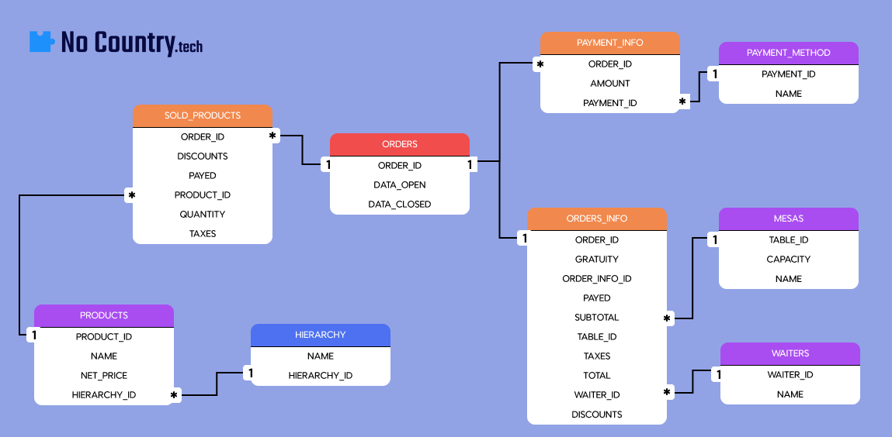

<h3><b>¡Bienvenid@s al repositorio del grupo 95 del cohorte 16 de data-bi de No Country! </b></h3>
 
<h1><b>DataChef: Optimización Gastronómica</b></h1>

En un mercado gastronómico cada vez más competitivo, la eficiencia y la rentabilidad son claves para el éxito. La vieja escuela de "intuición y experiencia" ya no basta. Los restaurantes que buscan destacarse necesitan herramientas que les permitan tomar decisiones estratégicas basadas en datos concretos.
Aquí es donde entra en juego el análisis de datos y los modelos predictivos. Estas tecnologías innovadoras ofrecen una ventana al futuro, brindando información invaluable sobre el comportamiento de los clientes, las tendencias del mercado y el rendimiento del negocio.
Este proyecto de análisis de datos tiene como objetivo aprovechar estas tecnologías para optimizar las operaciones y estrategias de ventas del restaurante, impulsando su eficiencia y rentabilidad a nuevos niveles.
A través de un análisis exhaustivo de los datos disponibles, se identificarán áreas de mejora, se desarrollarán modelos predictivos para la demanda y la toma de decisiones, y se personalizará la experiencia del cliente.

|Participantes|Roles|
|:---:|:---:|
|<a href="https://github.com/Franco-Arce">Franco Arce</a>||
|<a href="https://github.com/LeopoldoGitHub">Leopoldo Flores</a>||
|<a href="https://github.com/mferreyra">Matias Ferreyra</a>||
|<a href="https://github.com/Adrikarol">Adriana Muñoz</a>| |
|<a href="https://github.com/MrForii">Rodrigo Valdez</a>||
|<a href="https://github.com/jcdip2500">Julio Dip</a>||
|<a href="https://github.com/Matias-Ibarra">Matias Ibarra</a>| |
|<a href="https://github.com/MCCoronel">Maria Celeste Coronel</a>||
|<a href="https://github.com/bichitox">Carlos Loayza</a>||
|<a href="https://github.com/DiegoUriel1">Diego Gallegos Estudillo</a>||
|<a href="https://github.com/Angeltusp">Angel Gallegos Estudillo</a>||

<h1>Tecnologias utilizadas:</h1>

### Base de datos
- **Alojamiento:** AWS
- **Gestión:** MySQL

### Ciencia de datos
- **Lenguaje:** Python (con sus respectivas librerías)
- **Interpretes:** Visual Studio Code / Jupyter Notebook

### Análisis de datos
- **Limpieza y Visualización:**
- Excel
- Power BI

### ¿Cómo nos comunicamos?
- **Grupo - TL:**
  - Slack
 
- **Integrantes del grupo:**
  - Discord
  - Trello
 
<h1>Producto mínimo viable (MVP):</h1>
Nuestro MVP consiste en un gestor para restaurantes que trabaja a través de datos registrados por cada venta del local, estos datos están distribuidos en diferentes tablas relacionadas logicamente para dar
forma a una base de datos alojada en la nube. A través de esta base de datos podemos realizar distintas consultas, sobre ventas individuales, diarias, por productos, por mesa, por camarero, por forma de pago, etc.
Además de realizar predicciones de ventas que ayuden a la toma de decisiones.

****
 

  

****

### Memoria del proyecto con los distintos sprints:

### Sprint 0:
- #### Creación del canal de Discord:
Desde el grupo de Slack se propuso utilizar Discord como medio de comunicación por su facilidad para compartir pantalla, dividir la comunicación en canales y por ser una herramienta que la mayoría sabia utilizar.
En la imagen siguiente se muestra como fue la división de canales y salas de reuniones:

- #### Primeras reuniones para conocernos.
A través de Discord programamos un horario conveniente para tener nuestra primera reunión. En ella nos conocimos, compartimos nuestra experiencia previa, organizamos horarios y roles.

- #### Definición de horario de reuniones diarias.
Definimos que el horario de reunión diaria sería todos los días a las 9 AM hora Argentina, con exccepción de Lunes y Jueves cuando nos reunimos luego de la reunión con el TL (9:30 AM)

- #### Definiciñon roles:
Así quedaron definidos los roles:

- #### Primeras ideas sobre proyectos.
Se barajaron varias opciones al principio, pero la decisión por unanimidad fue crear un gestor de restaurantes
partiendo de datos reales del local donde trabaja una de las integrantes del grupo. Nos pareció la mejor opción no solo por el potencial que vimos en estos datos sino por tratarse de un caso real, lo que representa un desafio mayor.

### Sprint 1:

- #### Elección del proyecto
A partir de la elección de nuestro proyecto de ggestión de restaurantes, al que llamamos DataChef, comenzamos el print 1.

- #### User Stories:

1. Como propietario del restaurante, quiero poder acceder a análisis detallados sobre las ventas para la eficiencia operativa.
2. Como gerente del restaurante, quiero recibir predicciones de las ventas de productos para ajustar el inventario y evitar la escasez o el exceso de stock.
3. Como gerente del restaurante, quiero recibir mensualmente promociones más rentables para aumentar las ventas en horarios de poca demanda.
4. Como gerente del restaurante, quiero saber la eficiencia de los empleados para incrementar el ticket promedio.

- #### Primera extracción y limpieza de datos:
Obtenemos los datos con los que el restaurante cuenta actualmente, a través de la API con la que el local trabaja.
Podemos ver la estructura que tenian en ese momento:

En el archivo [conexión_api](./base_de_datos/conexion_api.ipynb) se puede ver todo el proceso de extracción y limpieza.

- #### Creación de tablas y relaciones:
Mediante cambios en la estructura de los datos, se definieron distintas tablas en las que dividimos los registros, para su escalabilidad. De esta manera la base de datos no solo es más eficiente y optimiza el rendimiento, sino que permite hacer análisis más detallados de algunos puntos importantes, como las ventas por productos.

En el archivo [conexión_bbdd](./base_de_datos/conexion_bbdd.ipynb) se puede ver también cómo se crean las diferentes tablas y sus relaciones.

- #### Creación de la base de datos en AWS
El método para alojar nuestros datos es Amazon Web Service.

En el archivo [conexión_bbdd](./base_de_datos/conexion_bbdd.ipynb) se puede ver también cómo se crean las diferentes tablas y sus relaciones.

- #### Conexión de la base de datos a Power Bi y primeros análisis
Una vez creada la base de datos, alojada en la nube, el equipo de análisis de datos comenzo con los primeros análisis.

### Sprint 2:
