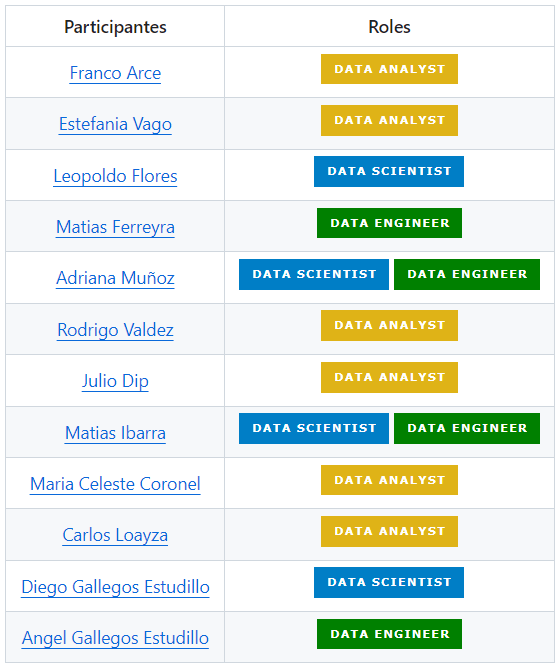
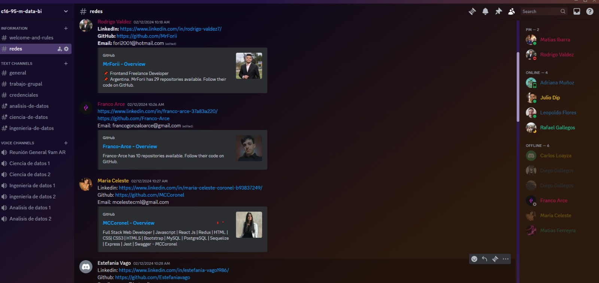
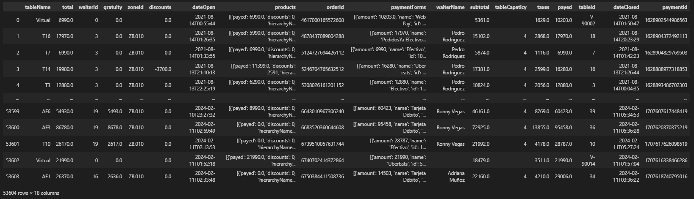
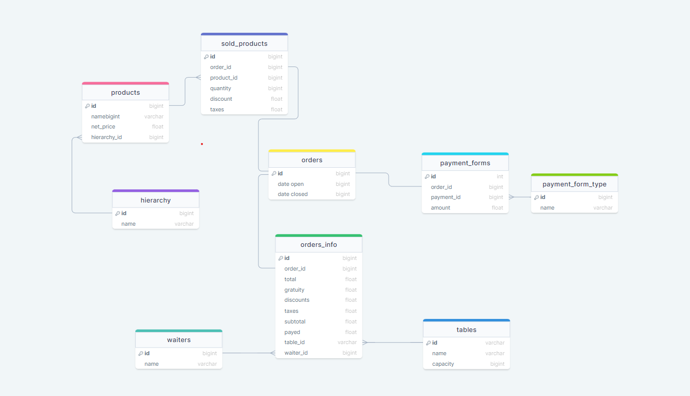

## 
Memoria de nuestro proyecto

### Sprint 0:
- #### Primeras reuniones para conocernos.
- #### Definición de horario de reuniones diarias.
- #### Definiciñon roles:

- #### Creación del canal de Discord:

- #### Primeras ideas sobre proyectos.

### Sprint 1:
- #### Elección del proyecto
- #### User Stories:

1. Como propietario del restaurante, quiero poder acceder a análisis detallados sobre las ventas para la eficiencia operativa.
2. Como gerente del restaurante, quiero recibir predicciones de las ventas de productos para ajustar el inventario y evitar la escasez o el exceso de stock.
3. Como gerente del restaurante, quiero recibir mensualmente promociones más rentables para aumentar las ventas en horarios de poca demanda.
4. Como gerente del restaurante, quiero saber la eficiencia de los empleados para incrementar el ticket promedio.

- #### Primera extracción y limpieza de datos:

En el archivo [conexión_api](./base_de_datos/conexion_api.ipynb) se puede ver todo el proceso de extracción y limpieza.

- #### Creación de tablas y relaciones:

- #### Creación de la base de datos en AWS